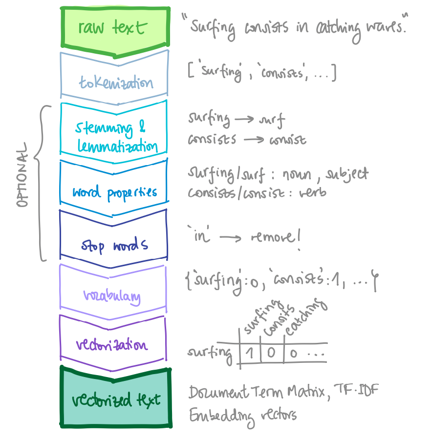
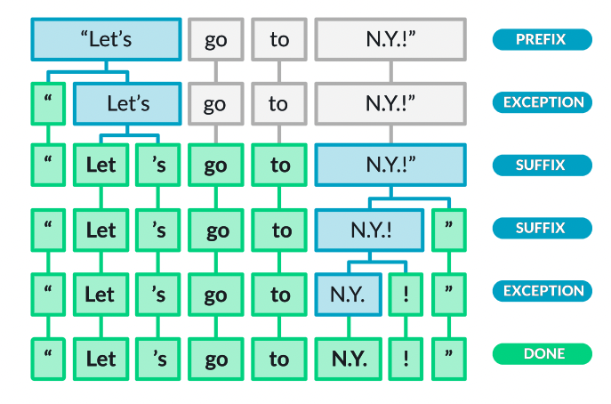
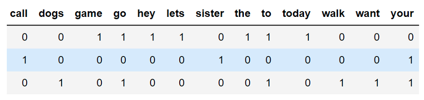
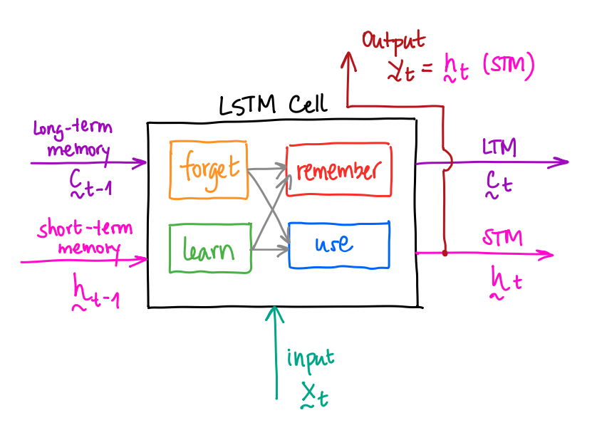

# Text Sentiment Analysis: A Collection of Notes and Examples

This repository collects/links projects related to text **sentiment analysis**, as well as some high level notes on the techniques used in the field, always focusing on **supervised text classification**.

:warning: Important notes, first of all:

[](https://shields.io/#your-badge)

- This is an on-going project; I will extend the content as far as I have time for it.
- In some cases, I will use the code from other public tutorials/posts rightfully citing the source.
- In addition to the examples, the links in the section [Interesting Links](#interesting-links) are very useful resources for those interested in the topic.

## Introduction

The techniques used in [sentiment analysis](https://en.wikipedia.org/wiki/Sentiment_analysis) are able to efficiently condense raw sequences of words to one valuable scalar which covers the spectrum from `negative` to `positive` (or an equivalent one). Then, that scalar can become an important feature in more complex models that output important business predictions. In my personal experience, that mapping from a text string to a number is very handy in plenty of businesses that work with tabular datasets that contain free text fields.

Note that text sentiment analysis is a text classification problem; as such, we can re-use some of the techniques to perform supervised topic inference with multiple classes (i.e., text themes). However, sentiment analysis has particular characteristics, such as the possibility of having *sarcasm*, which make it more challenging and specific.

This repository serves two purposes regarding the topic of **sentiment analysis** and related (supervised) **text classification** problems:

1. This is a document for my future self which collects techniques that I come across.
2. I present a primer on the basics of Natural Language Processing (NLP) for pragmatic engineers that specialize on other fields, but the Universe gifts them with valuable text data that needs to be classified.

Overview of Contents:

- [Text Sentiment Analysis: A Collection of Notes and Examples](#text-sentiment-analysis-a-collection-of-notes-and-examples)
  - [Introduction](#introduction)
  - [How to Use This](#how-to-use-this)
    - [Dependencies](#dependencies)
  - [Natural Language Processing Pipeline: General Notes](#natural-language-processing-pipeline-general-notes)
    - [Preprocessing](#preprocessing)
    - [Preprocessing with SpaCy](#preprocessing-with-spacy)
    - [Beyond the Vocabulary: Word Vectors, Bags and Sequences](#beyond-the-vocabulary-word-vectors-bags-and-sequences)
    - [Vectorization with Scikit-Learn](#vectorization-with-scikit-learn)
    - [Sentiment Analysis: A Classification Problem](#sentiment-analysis-a-classification-problem)
  - [Recurrent Neural Networks: General Notes](#recurrent-neural-networks-general-notes)
    - [Defining an LSTM cell in Pytorch](#defining-an-lstm-cell-in-pytorch)
  - [List of Examples + Description Points](#list-of-examples--description-points)
  - [Improvements, Next Steps](#improvements-next-steps)
  - [Interesting Links](#interesting-links)
  - [Authorship](#authorship)

## How to Use This

I collect, either

- links to other repositories, mine or others',
- notebooks,
- or code stored in folders.

All of them are referenced/indexed in the section [List of Examples + Description Points](#list-of-examples--description-points).

1. Select one example from the section [List of Examples + Description Points](#list-of-examples--description-points). If there are additional instructions, they should be in the folder where the example is.
2. If there is an `Open in Colab` button anywhere, you can use it :smile:.
3. If you'd like to run the code locally on your device install the [dependencies](#dependencies) and run the main file in it; often, the main file will be a notebook.

Additionally, the following sections give high-level explanations of the overall processes and tools necessary in Natural Language Processing (NLP):

- [Natural Language Processing Pipeline: General Notes](#natural-language-processing-pipeline-general-notes)
- [Recurrent Neural Networks: General Notes](#recurrent-neural-networks-general-notes)

### Dependencies

You should create a python environment (e.g., with [conda](https://docs.conda.io/en/latest/)) and install the dependencies listed in the [requirements.txt](requirements.txt) file of each example. If there is no such file in a folder example, the one in the root level should work.

A short summary of commands required to have all in place is the following; however, as mentioned, **each example might have its own specific dependency versions**:

```bash
conda create -n text-sent python=3.6
conda activate text-sent
conda install pytorch -c pytorch 
conda install pip
pip install -r requirements.txt
```

## Natural Language Processing Pipeline: General Notes

This section introduces very briefly the most essential tasks carried out for text preprocessing; if you require more information, you can check [my NLP Guide](https://github.com/mxagar/nlp_guide).

### Preprocessing

Raw text needs to be processed to transform words into numerical vectors. The following image summarizes usual steps that are performed to that end.



First, the text string needs to be properly split into basic units of meaning or **tokens**, i.e., we perform the **tokenization**. A figure from [Spacy: Linguistic Features](https://spacy.io/usage/linguistic-features) gives a good example of that process:



Quite often the token form of the word converted to a vector; however, that token can be further processed to more basic forms with **stemming and lemmatization**:

- Stemming: `runs --> run (stem)`
- Lemmatization: `was --> be (lemma)`

Additionally, several **properties of the word** can be identified, if required:

- Part of Speech (POS) or morphology: is it a noun, verb, adverb, punctuation, etc.?
- Syntactic function (dependency): is it the subject, a determinant, etc.?
- Named Entity Recognition (NER): is this a company name, a money quantity, etc.?

Next, typically ***stop-words* are removed**; these words that appear with high frequency and do not convey much information, e.g., "the", "of", etc. Similarly, punctuation symbols might be also candidates to be removed.

And finally, the **vocabulary** is built. This is an object which collects all possible tokens/words in a set; optimally, we should index all the tokens/words so that:

- given an index, we know its word/token text form,
- and given a word/token text form, we know its index.

Even though the preprocessing might seem a lot of effort, I've seen quite often to reduce the work to this **simplified recipe**:

1. Remove punctuation if punctuation symbols do not contain meaning for the application: `replace()` with `''` any character contained in the `string.punctuation` module.
2. Quick and dirty tokenization, i.e., basically split text strings: `text.lower().split()`.
3. Create a vocabulary using a `Counter()`, a `set()` and a `dict()`.

```python
from string import punctuation # '!"#$%&\'()*+,-./:;<=>?@[\\]^_`{|}~'
from collections import Counter

text =  """This story is about surfing.
        Catching waves is fun!
        Surfing's a popular water sport.
        """

# Remove punctuation
for char in punctuation:
    text = text.replace(char, "")

# Count word appearances
# We can do that for each class/sentiment
# and then compute the ratios for each word!
word_counts = Counter()
for word in text.lower().split(): # split removing white spaces, \n, etc.
    word_counts[word] += 1

# Index -> Word (Vocabulary)
index2word = list(set(word_counts.keys()))

# Word -> Index
word2index = {}
for i,word in enumerate(index2word):
    word2index[word] = i

# Vocabulary size: number of words
n = len(index2word)
```

However, if the punctuation symbols contain meaning for the application and we require more sophisticated tokenization, we can use the [SpaCy](https://spacy.io/) or [NLTK](https://www.nltk.org/) libraries, as shown:

```python
# Built-in string split: it separates in white spaces by default
text = "Dr. Smith arrived late."
word = text.split() # ['Dr.', 'Smith', 'arrived', 'late.']

# NLTK: More meaningful word tokenization
from nlt.tokenize import word_tokenize
words = word_tokenize(text) # ['Dr.', 'Smith', 'arrived', 'late', '.']

# NLTK: Sentence splits or tokenization
from nlt.tokenize import sent_tokenize
text = "Dr. Smith arrived late. However, the conference hadn't started yet."
words = sent_tokenize(text)
# ['Dr. Smith arrived late.',
#  'However, the conference hadn't started yet.']

# SpaCy: More meaningful word tokenization
import spacy
nlp = spacy.load('en_core_web_sm')
doc = nlp(text)
words = [token.text for token in doc]
```

Finally, if you'd like to squeeze the maximum amount of information from the text, you can have a look at the next section, which summarizes how to easily perform all the preprocessing steps I mentioned using [SpaCy](https://spacy.io/usage).

### Preprocessing with SpaCy

In the following, I provide some lines which show how to use [SpaCy](https://spacy.io/usage) to perform advanced text preprocessing. To figure out how to install SpaCy, look at the [SpaCy installation site](https://spacy.io/usage); and if you'd like more information on how to use the library, check my [my NLP Guide](https://github.com/mxagar/nlp_guide).

```python
import spacy

# We load our English model
nlp = spacy.load('en_core_web_sm')

# Create a _Doc_ object:
# the nlp model processes the text 
# and saves it structured in the Doc object
# u: Unicode string (any symbol, from any language)
doc = nlp(u'Tesla is looking at buying U.S. startup for $6 million')

# Print each token separately
# Tokens are word representations, unique elements
# Note that spacy does a lot of identification work already
# $ is a symbol, U.S. is handled as a word, etc.
for token in doc:
    # token.text: raw text
    # token.pos_: part of speech: noun, verb, punctuation... (MORPHOLOGY)
    # token.dep_: syntactic dependency: subject, etc. (SYNTAX)
    # token.lemma_: lemma
    # token.is_stop: is the token a stop word?
    print(token.text, token.pos_, token.dep_)

# Loop in sentences
for sent in doc.sents:
    print(sent)

# Print the set of SpaCy's default stop words
print(nlp.Defaults.stop_words)

# Named entities (NER)
for ent in doc.ents:
    print(ent.text, ent.label_, str(spacy.explain(ent.label_)))
```

### Beyond the Vocabulary: Word Vectors, Bags and Sequences

The vocabulary is basically a bidirectionally indexed list of words/tokens; bidirectional, because we can get from and index its text form and vice versa.

With the vocabulary defined, we can represent each word in two forms:

1. As **one-hot encoded sparse vectors** of size `(n,)`, being `n` the number of words in the vocabulary.
2. As compressed vectors from an **embedding** of size `(m,)`, with `m < n`.

In a sparse representation, a word is a vector of zeroes except in the index which corresponds to the text form in the vocabulary, where the vector element value is 1.

In a compressed representation we don't have sparse one-hot encoded vectors, but vectors of much smaller sizes that contain float values in all their cells. We can create those vector spaces in different ways; one option is to compress sparse vectors to a latent space (e.g., with an [autoencoder](https://en.wikipedia.org/wiki/Autoencoder)):

`[0, 1, 0, ..., 0] (n: vocabulary size) -> [0.2, 0.5, ..., 0.1] (m: latent word vector space)`

Typical sizes are `n = 70,000`, `m = 300`.

There are also **semantic embeddings**, which preserve the meaning relationships of words encoded as spatial relationships in the embedding spaces; thus, we can perform algebraic operations on the words:

`vector(queen) ~ vector(king) - vector(man) + vector(woman)`

Word vector similarities can be measured with their cosine similarity.

On the other hand, texts formed by words can be represented in the following general forms:

1. As **bags of words** (one-hot encoded).
2. As **sequences of word vectors** (usually compressed vectors).

The bag of words representation does not take into account the order in which the words appear in the text; with it we create a **Document Term Matrix** (DTM) of size `N x n`, being `N` the number of documents/texts and `n` the size of the vocabulary. In the cells of the DTM we can have:

- whether a word appears in a document/text,
- how many times it appears in that document/text,
- or the frequency of the word in that document considering also the rest of the documents.



Typically, the latter option works best. It consists in weighting the term frequency in each text with the inverse frequency of appearance in all the texts: **TF-IDF, Term Frequency, Inverse Document Frequency**. This approach takes into account the importance of a word in the whole corpus, i.e., the complete text dataset. As such, stop words get a lower weight, thus less importance.

The TFIDF formulas are as follows (although everything is automatically computed):

- $\textrm{tfidf}(t,d,D) = \textrm{tf}(t,d) \cdot \textrm{idf}(t,D)$

- $\textrm{tf}(t,d) = \textrm{count}(t \in d)$: `count (term t in document d)`

- $\textrm{idf}(t,D) = \log \frac{N}{| \{d \in D \, : t \in d \} |}$: `log (total documents N / documents which contain term t)`

Sequences of word vectors are typically used with neural networks, either in (1) [**Recurrent Neural Networks**](https://en.wikipedia.org/wiki/Recurrent_neural_network) (RNN) or (2) [Transformers](https://en.wikipedia.org/wiki/Transformer_(machine_learning_model)). The section [Recurrent Neural Networks](#recurrent-neural-networks-general-notes) introduces briefly how the former work and focuses on their application for text and NLP.

### Vectorization with Scikit-Learn

In the following, a very simple text vectorization snippet is shown with [Scikit-Learn](https://scikit-learn.org/stable/); in it, texts are vectorized as bags of words. Note that:

- Texts are transformed into feature vectors and stacked in rows, as it is usually done with the `X` matrix in other tabular datasets.
- **We don't need to create any vocabulary with this approach**, it is done automatically.
- We can use the produced `X_train_tfidf` in any classifier!

```python
import numpy as np
import pandas as pd
from sklearn.feature_extraction.text import CountVectorizer
from sklearn.feature_extraction.text import TfidfVectorizer

df = pd.read_csv('./data/reviews.csv')
# shape: (3733, 2)
# columns:
# - label: 1 (positive) / 0 (negative)
# - review: reviews that can be positive or negative

from sklearn.model_selection import train_test_split

X = df['review']
y = df['label']

X_train, X_test, y_train, y_test = train_test_split(X,
                                                    y,
                                                    test_size=0.33,
                                                    random_state=42)

count_vect = CountVectorizer()
X_train_counts = count_vect.fit_transform(X_train)
X_train_counts.shape # (3733, 7082)

tfidf_vect = TfidfVectorizer()
X_train_tfidf = tfidf_vect.fit_transform(X_train)
X_train_tfidf.shape # (3733, 7082)
```

### Sentiment Analysis: A Classification Problem

Once the text is vectorized either as bags of words or as sequences of vectors, 

```python
from sklearn.svm import LinearSVC

clf = LinearSVC()
clf.fit(X_train_tfidf, y_train)

X_test_tfidf = tfidf_vect.transform(X_test)

probs = clf.predict_proba(X_test_tfidf)
preds = clf.predict(X_test_tfidf)
```

Note that we could easily transform the sentiment analysis problem into other types of applications if the dataset is appropriate (i.e., we have the necessary information):

- Any kind of binary classification, e.g., spam vs. not spam.
- Any kind of multi-class classification, e.g., topic of theme classification (if the labels contain topic annotations).

However, bear in mind that sentiment analysis has the additional difficulty of possible uses of irony and sarcasm.

## Recurrent Neural Networks: General Notes

While CNNs capture spatial relationships, RNNs capture sequential information. The basic way of generating RNNs is using **Simple Recurrent Neurons** or **Elman Networks**, which re-use their previous memory state as input in the next state, as shown in the image:


Note that the folded model of the simple RNN neuron is basically like a layer which has three vectors and three mapping matrices:

- `x_t`: input vector at time step `t`.
- `y_t`: output vector at time step `t`.
- `s_t`: memory state at time `t`.
- `W_x`: weight matrix connecting the inputs to the state layer.
- `W_y`: weight matrix connecting the state to the output.
- `W_s`: weight matrix connecting the state from the previous timestep to the state in the following timestep.

Note that we can stack several of such RNN cells or layers; the output of the previous becomes the input for the next. When we define an RNN cell in Pytorch, we specify

- the sizes of the input and hidden/output vectors
- and the number of layers that make up the RNN, i.e., the number of RNN cells that are stacked (typically 1-3).

If we unfold the model and compute the gradients propagating the error in the network, we see that the error derivatives with respect to `W_x` and `W_s` are the summation of the current derivative and all the previous ones.

However, not all previous derivates are considered due to the **vanishing gradient** problem; in practice, the 8-10 previous steps are used. Similarly, to avoid the **exploding gradient** issue, **gradient clipping** is applied: if the gradient exceeds a threshold, it is normalized.

In fact, simple RNNs are not that used because they fall in the **vanishing gradient** problem. Instead, **Long Short-Term Memory (LSTM) units** are usually employed, which were invented by Schmidhuber et al. in 1997 to target specifically the vanishing gradient issue.

The LSTM cells are able to keep for longer periods of time past events: +1000 steps backwards can be considered, not only 8-10. Additionally, with the use of sigmoid and `tanh` activations, LSTM cells can control

- which information to remove
- which to store and
- when to use it
- and when to pass the information to the next stage.

In the following, I will briefly explain the intuition of the LSTM cell without going into details. If interested, Christopher Olah has a great post which explains what's happening inside an LSTM unit: [Understanding LSTM Networks](http://colah.github.io/posts/2015-08-Understanding-LSTMs/). 

LSTM cells segregate the memory input/output into two types: 

- short-term memory, which captures recent inputs and outputs.
- and long-term memory, which captures the context.
 
Therefore, in practice we have:

- Three inputs:
  - signal/event: `x_t`
  - previous short-term memory: `h_(t-1)`
  - previous long-term memory : `C_(t-1)`
- Three outputs: 
  - transformed signal or output: `y_t = h_t`
  - current/updated short-term memory: `h_t`
  - current/updated long-term memory: `C_t`

Note that the updated short-term memory is the signal output, too!

All 3 inputs are used in the cell in **4 different and interconnected gates** to generate the 3 outputs; these internal gates are:

- Forget gate: useless parts of previous long-term memory are forgotten, creating a lighter long-term memory.
- Learn gate: previous short-term memory and current event are learned.
- Remember gate: we mix the light long-term memory with forgotten parts and the learned information to form the new long-term memory.
- Use gate: similarly, we mix the light long-term memory with forgotten parts and the learned information to form the new short-term memory.



In summary, the LSTM cell is able to capture the context and the recent items in the fed sequences applying several mappings via four gates internally. A key aspect of the cell is that **it is differentiable**, so we can apply backpropagation and optimize the parameters to minimize the error.

An alternative to LSTMs are the **Gated Recurrent Units (GRUs)**, which appeared later. They simplify the recurrent cell while achieving similar performances.

For more information, see: [Gated Recurrent Units (GRU)](http://www.cs.toronto.edu/~guerzhoy/321/lec/W09/rnn_gated.pdf).

### Defining an LSTM cell in Pytorch

In the following example, the basic usage of an LSTM cell in Pytorch is shown. Input vectors of 4 items map to output vectors of 3 items with one cell. We can pass sequences of vectors, i.e., several vectors arranged in a tensor. One vector can be a word after being transformed into an embedding.

Notes: 

- `nn.LSTM` is more like a layer than a neuron, as happens with `nn.RNN`; its equivalent would be `nn.Linear`. Additionally, `nn.LSTM` can have several layers inside.
- We can pass one vector after the another in a loop. However, it's more efficient to pass several vectors together in a tensor. Note this is not a batch - a batch would be another grouping on top of that. It is rather a sequence. If a vector is a word, it would be a sentence!
- When we input a sequence, we get as output a sequence of the same length; the output sequence is composed of hidden memory state vectors. The size of a hidden state vector doesn't need to be the same as the size of an input vector.

```python
import torch
import torch.nn as nn
from torch.autograd import Variable

# input_dim: number of inputs, length of the input vector, number of units in the input vector
# hidden_dim: number of ouputs, length of the output vector, number of units in the output vector
# n_layers: number of hidden layers used; 1 == the LSTM cell has 1 hidden state
# Note that we pass a SEQUENCE of vectors of dimension input_dim;
# The length of the sequence appears later
input_dim = 4 # example: dimensions of the input word embedding
hidden_dim = 3 # example: number output class categories, if we directly have the output after the LSTM
n_layers = 1 # usually 1 (default) to 3
lstm = nn.LSTM(input_size=input_dim, hidden_size=hidden_dim, num_layers=n_layers)
# We can add dropout layers on the outputs of each LSTM layer if we add the argument dropout=drop_p
# drop_p needs to be non-zero; dropout layer is added in all layers except the last one.
# Default: 0
# Also, we can use argument batch_first=True (especially relevant when DataLoaders are used).
# Then, we expect the input size:
# (batch, seq, feature) instead of (seq, batch, feature)
# Similarly, the output size will be
# (batch, seq, out) instead of (seq, batch, out)

# Make a sequence of 5 input vectors of 4 random values each
# Ie., each vector is of dimension 4 (=input_dim)
inputs_list = [torch.randn(1, input_dim) for _ in range(5)]

# Turn input vectors into a tensor with 5 rows of data.
# This is our SEQUENCE.
# Note that the LENGTH of the SEQUENCE is ARBITRARY!
# Add the extra 2nd dimension (1) for batch_size.
# We can also pass each of the 5 vectors one after the other,
# but packing them together is more efficient.
# This seems to be a batch -- but a batch is an additional grouping
# on top of it. IT IS A SEQUENCE.
# Batch size != sequence length.
batch_size = 1
inputs = torch.cat(inputs_list).view(len(inputs_list), batch_size, -1) 

# Size: (number of sequences, batch size, input_dim)
print('inputs size: \n', inputs.size()) # [5, 1, 4]

# Initialize the hidden states: short- and long-term memories
# We have so many as layers we have defined.
# h0: (n_layers, batch_size, hidden_dim)
# c0: (n_layers, batch_size, hidden_dim)
h0 = torch.randn(n_layers, batch_size, hidden_dim)
c0 = torch.randn(n_layers, batch_size, hidden_dim)

# Wrap everything in torch Variable
# Torch Variables are a wrapper around tensors; they represent a node in a graph,
# and they have almost the same operations as tensors.
# To obtain a tensro from a Variable: var.data
# To obtain the gradient tensor of a Variable: var.grad.data
inputs = Variable(inputs)
h0 = Variable(h0)
c0 = Variable(c0)
# get the outputs and hidden state
#output, hidden = lstm(inputs, (h0, c0))
output, (h1, c1) = lstm(inputs, (h0, c0))

# output size: [5, 1, 3]: one output of 3 elements for each of the 5 sequences of 4 elements
# hidden size, (h1, c1): we get the last hidden state; INPUT for the next LSTM
# h1: [1, 1, 3] 
# c1: [1, 1, 3]
```

## List of Examples + Description Points

- [NLTK VADER](https://github.com/mxagar/nlp_guide/blob/main/05_Semantics_Sentiment_Analysis/02_Sentiment_Analysis.ipynb)
  - [VADER](https://www.nltk.org/_modules/nltk/sentiment/vader.html) = Valence Aware Dictionary for sEntiment Reasoning.
  - Amazon reviews analyzed.
  - We can apply VADER directly to unlabelled text data to obtain the strength of the sentiment in 3 different directions: positive, neutral and negative; all 3 are also compounded to a 4th value.
  - VADER maps lexical features to sentiment scores; the sentiment score of a text is the sum of the sentiment score of each word.
  - Negation is understood.
  - Exclamation marks, capitals, are taken into account.
  - Sarcasm is not captured.
  - The VADER model is already prepared for us, we don't need to have a labelled dataset not training.
  - The performance is not that good though: 60%-70% accuracy.
- [Sentiment Analysis Neural Network with Numpy](https://github.com/mxagar/deep-learning-v2-pytorch/tree/master/sentiment-analysis-network)
  - A sentiment analysis network is created from scratch with Numpy.
  - Movie reviews analyzed.
  - Word ratios in positive and negative reviews are computed.
  - Words are encoded as one-hot vectors:
    - First input is word count in review
    - Then, better just appearance (because it works better - less noise)
  - Network class is defined by class:
    - input: vocabulary size
    - hidden: parameter (10)
    - output: 1
  - All necessary functions are programmed: train, test, etc.
  - Network functions are optimized for efficiency in their programming.
  - The most similar words are found with the dot product of the columns/rows of the first weight matrix.
- [Sentiment Analysis RNN using LSTM cells with Pytorch](https://github.com/mxagar/deep-learning-v2-pytorch/tree/master/sentiment-rnn)
  - This notebook improves the basic sentiment analysis model network without RNNs: [Sentiment Analysis Neural Network with Numpy](https://github.com/mxagar/deep-learning-v2-pytorch/tree/master/sentiment-analysis-network).
  - The network receives a batch of reviews. Reviews are tokenized and encoded as integers. The sequence length (number of words per review) is fixed: 200; thus, we either truncate the texts if longer or pad them with 0s on the left.
  - The trained network is able to yield a value 0-1 which denotes the positive (1) or negative (0) sentiment of any text.
  - The efficiency I got with the test split was 96.8%; that's very high!
  - Steps:
    - Load data and pre-process it:
    	- punctuation is removed,
    	- words are tokenized with `split()`
    	- a vocabulary dictionary is built
    	- tokens are encoded as integers
    	- outliers are removed (reviews with length 0)
    	- encoded reviews are converted to a fixed sequence length with truncation or left zero padding
    - Training, validation and test splits are created
    - Data loaders
    - Model definition: Embedding, LSTM, Linear, Dropout, Sigmoid
    - Training
    - Saving and loading model
    - Testing
    - Inference / Prediction function

## Improvements, Next Steps

- [ ] Compare RNN against best classifier (e.g., XGBoost) in the context of sentiment analysis.
- [ ] Apply `GridSearchCV` to find the best hyperparameters for the Sentiment Analysis RNN using [skorch](https://github.com/skorch-dev/skorch).

## Interesting Links

- My blog post on [text generation RNNs](https://mikelsagardia.io/blog/text-generation-rnn.html).
- [My notes and code](https://github.com/mxagar/deep_learning_udacity) on the [Udacity Deep Learning Nanodegree](https://www.udacity.com/course/deep-learning-nanodegree--nd101).
- More examples with RNNs using Pytorch: [Pytorch Guide](https://github.com/mxagar/deep_learning_udacity/blob/main/02_Pytorch_Guide/DL_Pytorch_Guide.md) (Section "Recursive Neural Networks").
- [NLP Guide](https://github.com/mxagar/nlp_guide).
- [Emotion Classification](https://en.wikipedia.org/wiki/Emotion_classification).
- [Understanding LSTM Networks, by Chris Olah](http://colah.github.io/posts/2015-08-Understanding-LSTMs/)
- [Exploring LSTMs, by Edwin Chen](http://blog.echen.me/2017/05/30/exploring-lstms/)
- [Karpathy's Lecture: Recurrent Neural Networks, Image Captioning, LSTM](https://www.youtube.com/watch?v=iX5V1WpxxkY)
- [Skorch: A Scikit-Learn Wrapper for Pytorch](https://github.com/skorch-dev/skorch): Use Pytorch classifiers in `Pipeline` or `GridSearchCV`.

## Authorship

Mikel Sagardia, 2022.  
No guarantees.

You are free to use this project, but please link it back to the original source.